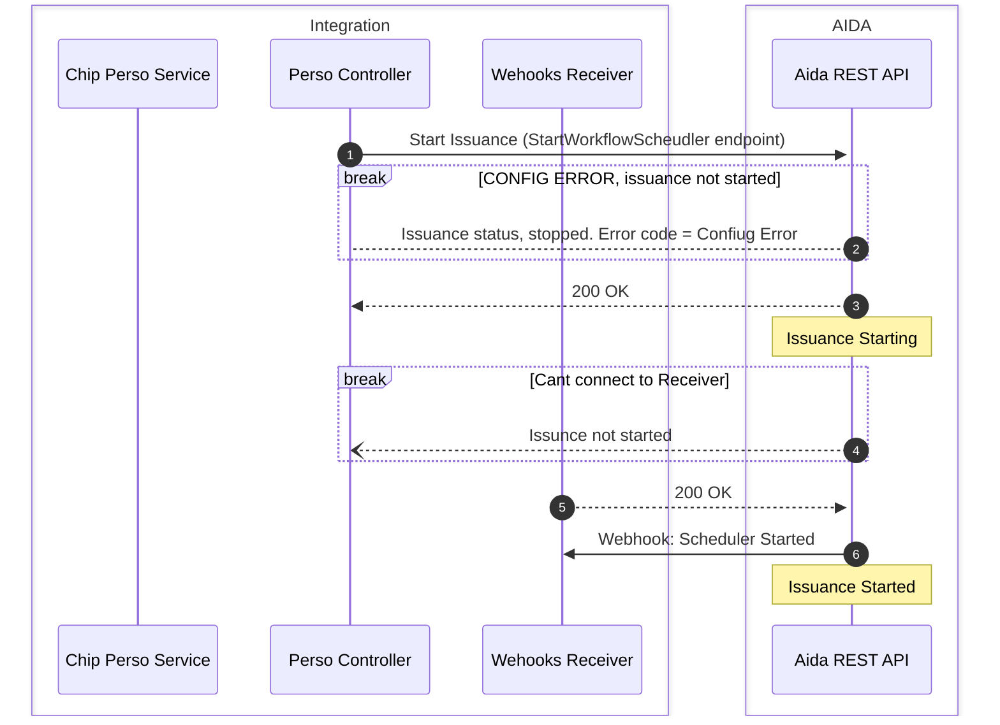
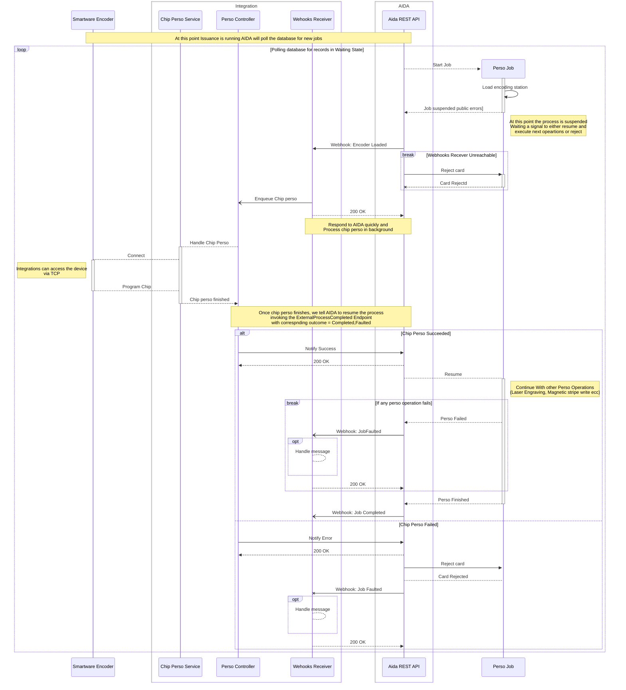

## AIDA Webhooks Integration 

------

### Introduction

If `Webhooks` are enabled in the `JobTemplate`'s configuration. AIDA publishes notifications when relevant events occur during 
issuance. 
`Webhooks` are `JSON Encoded` and transmitted as `HTTP POST` quests.

For operations like **Chip Encoding, Readback and OCR** webhooks are mandatory. The receiving application must respond to webhook requests
with a successful `HTTP Status Code (2xx)` 

We can separate message in 3 categories: 

#### External Process Messages

- [EncoderLoadedMessage](#encoderloadedmessage-suspends-workflow)
- [OcrExecutedMessage](#ocrexecutedmessage-suspends-workflow)

These messages indicate that AIDA suspended the execution of a Job and it is waiting an external operation to complete (OCR output validation, Chip Encoding reading/writing). The receiving application can singnal the completion of the operation by sending an [ExternalProcessCompletedMessage](#externalprocesscompletedmessage) to the ***SignalExternalProcessCompleted*** API endpoint.

##### Examples 
- [Handling EncoderLoaded Message](#handling-encoderloaded-message)

#### Recoverable Error Messages

- [WorkflowSchedulerProcessSuspendedMessage](#workflowschedulerprocesssuspendedmessage-suspends-workflow)

These messages indicate that issuance was suspended and manual intervention is required.  

Recoverable error statuses are: 
- Input feeder empty 
- Open Interlock 
- Card Jam (Only in box systems)

The controlling application can: 

1. Tell AIDA to resume issuance and retry 
2. Stop issuance 

##### Examples 
- [Handling SchedulerProcessSuspended Message](#handling-schedulerprocesssuspended-message)

#### Diagnostic Messages

All other messages require the receiving application to respond with a `2xx` status code, indicating that the message was received. 

- [WebhooksReceiverHealthCheck](#webhookreceiverhealthcheckmessage)
- [WorkflowSchedulerStarted](#workflowschedulerstartedmessage)
- [WorkflowSchedulerStopped](#workflowschedulerstoppedmessage)
- [WorkflowStarted](#workflowfaultedmessage) 
- [WorkflowCanceled](#workflowcancelledmessage) 
- [WorkflowCompleted](#workflowcompletedmessage)
- [WorkflowFaulted](#workflowfaultedmessage)

#### Error Codes & Job Statuses

- [Job Statuses](#jobstatus)
- [Error Codes](#errorcodes)

#### Sequence Diagrams 


- [Starting Issuance](#issuance-startup-sequence)
- [Chip Encoding](#chip-encoding-sequence)

#### Examples

- [Handling EncoderLoaded Message](#handling-encoderloaded-message)
- [Handling SchedulerSuspended Message](#handling-schedulerprocesssuspended-message)

---

#### Serialization
`Enums` are serialized as strings, and properties are serialized in `camelCase`. 


### Webhook Messages Types 

Below there's a listing of all webhook messages. 

#### MessageType

```csharp
public enum MessageType
{
    // default value, webhook receivers should never get this
    Unknown,
    // encdoer loaded message (sent when a card is placed in one of the encoders)
    EncoderLoaded,
    // ocr executed message (sent at the end of an ocr reading)
    OcrExecuted,
    // workflow started (sent when a new job is started)
    WorkflowStarted,
    // workflow completed (sent when a job is completed)
    WorkflowCompleted,
    // workflow faulted (sent when a card is rejected)
    WorkflowFaulted,
    // workflow cancelled (sent when a job is cancelled)
    WorkflowCancelled,

    // -- deprecated -- 
    // The feeder empty message was replaced by WorkflowSchedulerSuspended
    // with error code = FeederEmpty
    FeederEmpty,
    // workflwo scheduler started message (if webhooks are enabled, it is sent when 
    // AIDA beings polling the database for jobs to process)
    WorkflowSchedulerStarted,
    // workflow scheduler stopped message (issuance stopped)
    WorkflowSchedulerStopped,
    // workflow scheduler suspended (issuance suspedned)
    WorkflowSchedulerSuspended,
    // healtcheck message
    HealthCheck
}
```

#### Common Properties


All webhook messages inherit from `WorkflowMessage` which has the following properties

```csharp
// All webhook messages extends from WorkflowMessage
abstract class WorkflowMessage 
{
    // identifiers to recongnize which machine is sending the message
    // these are usefull if the receiving application control more than one 
    // machine
    public string MachineName;
    public string MachineSerial;
    public string HostName;

    // The value of the job_id field in the Data Exchange Table
    public string JobId;
    // The value ofr the batch_id field
    public string BatchId;
    // The value ofr the correlation_id field
    public string CorrelationId;

    // unique identifier for the webhook message
    public string MessageId;

    // identifier of the process for this job. These field is required to resume jobs
    // when using the Signal
    public string WorkflowInstanceId;

    // the name of the workflow definition used for the job's workflow instance
    public string WorkflowInstanceName;
    
    // Enum that identifies the message kind 
    public MessageType MessageType;

    // The current status of the job 
    public JobStatus JobStatus;

    // An error code that signals the reason why the job has the current JobStatus
    public JobErrorCodes ErrorCode; 

    // The same value as the `AdditionalMetadata` value sent to AIDA when starting 
    // issuance. See `StartWorkflowScheduler` API endpoint documentation for more 
    // information 
    public Dictionary<string, object?> AdditionalMetadata; 
    
    // If `true` all perso operations where executed on the card. 
    // This is usefull if all operations where executed but the workflow fails. 
    // Example: 
    // Job template with `Chip Encoding` and `Laser Engraving` enabled. 
    // - Chip Encoding executes without problems
    // - Laser Engraving executes without problems
    // - The crad gets stuck in the machine when AIDA is trying to move it from the 
    // laser position to the output stacker. 
    // In this case the job will enter the `Faulted` state with error code `CardJam` and 
    // AIDA will publish the `WorkflowFaultedMessage` with `ErrorCode` = `CardJam` and 
    // `DocumentProduced` = True
    public bool DocumentProduced;

    // Set to `true` when any of the operations executed on the card are destructive: 
    // - Laser Engraving
    // - Chip Encoding 
    // - Magnetic stripe write
    public bool DestructiveOperationExecuted;

    // If a critical error occurs (CardJam is one of these), AIDA will cancel the execution 
    // of jobs that cannot recover from the current error state. 
    // The SourceJobInstanceId contains the Identifier of the job that triggered the error
    // in first place 
    public string SourceJobInstanceId;

    // Contains the `CLR` type name and it is used to support polymorphism 
    // during serialization/deserialization
    public string Discriminator;

} 
```
#### Job Statuses and Error Codes

Job statuses are used to indicate if the job is currently running or not. Error codes are used to signal the reason why `Jobs` are in a specific `JobStatus`;

##### JobStatus
```csharp
public enum JobStatus
{
    None,

    /// <summary>
    /// Inserted in the data exchange table but not yet picked up by the workflow scheduler
    /// </summary>
    Waiting,

    /// <summary>
    /// The workflow engine is about to executing (or is executing) the first 
    /// activity. we consider the job
    /// Running once we know that the card was moved from the feeder. 
    /// </summary>
    Starting,
   
    /// <summary>
    /// We are resuming the workflow after suspension. 
    /// This happens when we receive a notification from
    /// a webhooks receiver. Workflows are suspended 
    /// when we need to wait for external systems to perform
    /// operations on the document (chip encoding, OCR validation etc, feeder empty). 
    /// </summary>
    Resuming,

    /// <summary>
    /// workflow created and started
    /// </summary>
    Running,

    /// <summary>
    /// workflow completed correctly 
    /// </summary>
    Completed,

    ///<summary>
    /// workflow was manually cancelled
    /// </summary>
    Cancelled,

    /// <summary>
    /// Workflow waiting for an external signal to resume
    /// </summary>
    Suspended,

    /// <summary>
    /// rejected
    /// </summary>
    Rejected,

    /// <summary>
    /// faulted
    /// </summary>
    Faulted,
}
```
##### ErrorCodes
```csharp
public enum JobErrorCodes
{
    /// <summary>
    /// No errors so far
    /// </summary>
    NoErrors,

    /// <summary>
    /// Workflow scheduler stopped from API
    /// </summary>
    ManualStop,

    /// <summary>
    /// Generic Error
    /// </summary>
    GenericError,

    /// <summary>
    /// The firmware returned CardJam during a move card
    /// </summary>
    CardJam,

    /// <summary>
    /// SCAPS returned an error code during mark
    /// </summary>
    MarkLayoutFailed,

    /// <summary>
    /// Open interlocks
    /// </summary>
    OpenInterlock,

    /// <summary>
    /// The layout that is being marked lays outside the operable area of the laser 
    /// modules scan head
    /// </summary>
    MarkErrorLayoutOutOfBounds,

    /// <summary>
    /// The entity list that needs to be marked is empty
    /// </summary>
    MarkErrorEntitySelectionEmpty,

    /// <summary>
    /// Another mark process is being executed 
    /// </summary>
    MarkErrorMarkAlreadyExecuting,

    /// <summary>
    /// External process signaled completion with outcome "Faulted"
    /// </summary>
    ChipPersonalizationFailed,

    /// <summary>
    /// Mag stripe encoder nack while reading 
    /// </summary>
    MagStripeReadFailed,

    /// <summary>
    /// Mag stripe encoder nack while writing
    /// </summary>
    MagStripeWriteFailed,

    /// <summary>
    /// External validation signaled completion with outcome "Faulted"
    /// </summary>
    OcrUnexpectedResult,

    /// <summary>
    /// Image acquisition failed when trying to perform ocr
    /// </summary>
    OcrFailedToAcquireImage,

    /// <summary>
    /// OCR algorithm execution failed. This might happen if configuration or parameters
    /// are invalid
    /// </summary>
    OcrFailedToExecuteAlgorithm,

    /// <summary>
    /// We could not find the configured pattern. This might indicate that the image
    /// acquired is not good or the card is not in the correct position
    /// </summary>
    AutoPosFailedToMatchPattern,

    /// <summary>
    /// The webhook receiver did not send an HTTP Response within the configured timeout
    /// </summary>
    WebhookAckTimeout,

    /// <summary>
    /// Cannot reach the webhooks receiver
    /// </summary>
    WebhooksServerUnreachable,

    /// <summary>
    /// Input feeder is empty. 
    /// </summary>
    FeederEmpty,

    /// <summary>
    /// During startup AIDA checks if there are workflows in inconsistent states 
    /// (eg. Running, Suspended). 
    /// If it finds any, it sets the status to `Cancelled` with this error code. 
    /// Workflows in inconsistent states if the machine is shutdown during issuance 
    /// </summary>
    CancelledOnStartup,

    /// <summary>
    /// We received the ExternalProcessCompletedMessage 
    /// with value `Faulted` after `OcrValidation`
    /// </summary>
    OcrExternalValidationKo,

    /// <summary>
    /// Happens if the CCI Api returns 0 when loading the sjf file
    /// </summary>
    FailedToLoadJobTemplate,

    /// <summary>
    /// This status is set if a card needs to be moved but the transport is in error
    /// state. Might happen in a situation like the following:
    ///
    /// - card jam occurs while moving card `N`
    /// - card `N+1` needs to be moved but the status is not in `Ready` state 
    /// </summary>
    InvalidTransportStatus,
}
```

#### EncoderLoadedMessage (Suspends Workflow)
 
Sent by the machine when a card is placed in one of the available encoding stations. 

```csharp 
/// Sent when the machine places a card in one of the encoding stations
public class EncoderLoadedMessage : WorkflowMessage
{

    public override MessageType Type => MessageType.EncoderLoaded;
    // String identifier for the encoder (set in AIDA server configuration)
    public String EncoderId;
    // Index of the encoder 
    // (0 based index for the encoder, indices increase from right to left)
    public int EncoderIndex;
    // URL that needs to be invoked to signal AIDA
    // when the encoding process is finished
    // You can ignore this parameter and just invoke the 
    // SignalExternalProcessCompleted API Endpoint
    public String CallbackUrl;
}
```

#### OcrExecutedMessage (Suspends Workflow)

At the end of an OCR reading, the machine sends `OcrExecutedMessage` containing the 
result of the readings.

```csharp 
public class OcrExecutedMessage : WorkflowMessage
{
    public MessageType MessageType => MessageType.OcrExecuted;
    // The result of the OCR inspections ran by the machine
    public Array<RuntimeOcrInspectionResult> Results;
}

public class RuntimeOcrInspectionResult
{
    // the name of the inspection used to execute the OCR reading
    // this is part of the job template's configuration
    public String InspectionName;
    // The reuslt of the OCR Reading
    public OCRResult OcrResult;
}

public class OCRResult
{

    // UTF8 text returned by the OCR Engine
    public String Text;
    // Mean confidence of the recongnized text
    // These can be used to decide if the r
    public float MeanConfidence;
}
```
#### WorkflowSchedulerProcessSuspendedMessage (Suspends Workflow)

This message can be published for 2 reasons: 
1. The Input Feeder Is empty (`ErrorCode = FeederEmpty`) 
2. The machine detected an open interlock **before** engraving the card. The **before** is very important here, if the machine detects open interlocks **during** laser engraving the card will be rejected, since opening an interlock automatically disables the laser source.  
3. A card jam occurred and can be recovered (`ErrorCode = CardJam` Only for BOX systems, desktop machines cannot recover from `CARD_JAM`)

```csharp
public class WorkflowSchedulerProcessSuspendedMessage : WorkflowMessage 
{
    public MessageType MessageType => MessageType.WorkflowSchedulerSuspended;
}
```

#### WebhookReceiverHealthCheckMessage 

The `WebhookReceiverHealthCheckMessage` is used by AIDA to test `WebhooksReceiver` availability, it is sent: 

1. When users click the `Test` button in the `Webapp` 
2. During `Issuance graceful stop`
 
```csharp
public class WebhookReceiverHealthCheckMessage : WorkflowMessage 
{
    public MessageType MessageType => MessageType.HealthCheck;
}
```

#### WorkflowCancelledMessage

Published when a workflow is cancelled. The reason why the job was cancelled is indicated in the `ErrorCode` property.

```csharp
public class WorkflowCancelledMessage : WorkflowMessage 
{
    public MessageType MessageType => MessageType.WorkflowCancelled;
}
```
#### WorkflowCompletedMessage

Published at the end of the personalization process. This message indicates that the card was successfully produced and was moved
to the output stacker

```csharp 
public class WorkflowCompletedMessage : WorkflowMessage 
{
    public MessageType MessageType => MessageType.WorkflowCompleted;
}
```

#### WorkflowFaultedMessage

Published if an error occurred during the production process or any of the external processes returned `Outcome = Faulted`. 
The `ErrorCode` property contains the reason of the fault.

```csharp
public class WorkflowFaultedMessage : WorkflowMessage 
{
    public MessageType MessageType => MessageType.WorkflowFaulted;
}
```

#### WorkflowSchedulerStartedMessage

Sent when AIDA starts polling the database for records

```csharp
public class WorkflowSchedulerStartedMessage : WorkflowMessage 
{
    public MessageType MessageType => MessageType.WorkflowSchedulerStarted;
}
```
#### WorkflowSchedulerStoppedMessage

Sent when all running jobs finished executing. This message is necessary because issuance can be stopped in 2 modalities 

1. *Graceful stop* - AIDA stops processing records from the DB and finish all the processes that are already executing 
2. *Abort* - AIDA stops processing records from the DB, aborts all running operations, cancels all running jobs which will result in cards being rejected.  

```csharp
public class WorkflowSchedulerStoppedMessage : WorkflowMessage
{
    public WorkflowSchedulerStopReason StopReason;
}

public enum WorkflowSchedulerStopReason
{
    // The scheduler finished processing all the cards in a batch
    BatchCompleted,
    // The StopWorkflowScheduler endpoint was invoked 
    // while issuance was suspended with `FeederEmpty` error code
    FeederEmpty,
    // The StopWorkflowScheduler endpoint was invoked to stop issuance 
    ManualStop,
    // A card got stuck in the machine's transport 
    // and was not possible to recover
    CardJam,
    // An uncaught exception killed a job
    UnhandledException,
    // The webhooks receiver is unreachable
    WebhooksServerUnreachable,
    // The data source configuration for the selected job template is invalid
    InvalidDataSourceConfiguration,
    // AIDA was not able to reset the transport when starting issuance
    TransportResetFailed
}
```
#### ExternalProcessCompletedMessage

This is the payload that `Webhook Receivers` must send when invoking the `SignalExternalProcessCompleted` endpoint. Only 2 properties are required and they are: 

1. `WorkflowInstanceId` 
2. `Outcome` 

AIDA includes the `WorkflowInstanceId` in all webhook messages. `Outcome` is required and tells AIDA if the external process succeeded or not.
set it to `Completed` if the operation succeeds, `Faulted` otherwise. 

```csharp
public class ExternalProcessCompletedMessage
{
    // Optional. If present it is stored in the Data Exchange Table. Can be used
    // to store error descriptions when the external process fails
    public string? ErrorReason { get; set; }

    // It must contain the same value sent by AIDA in webhook messages. 
    public string WorkflowInstanceId { get; set; }

    // Optional. Overrides the default behavior of AIDA when it handles
    // The ExternalProcessCompletedMessage. 
    public WorkflowAction? RequiredAction { get; set; }
    // The outcomeo of the external operation 
    public ExternalProcessOutcome Outcome { get; set; }
}


// The outcome of the external process execution result
public enum ExternalProcessOutcome
{
    // The external process succeeded
    // The process resumes
    Completed,
    // The external process succeeded
    // The card is rejected
    Faulted,
    // The external was cancelled
    // The card is rejected
    Canceled
}


// Used in ExternalProcessCompleted to override the default behavior
public enum WorkflowAction
{
    // Forces AIDA to reject the card
    Reject,
    // Forces AIDA to resume the process
    Resume
}
```
### Sequence Diagrams

Below you can find sequence diagrams that illustrate the Issuance startup sequence and the interations between AIDA 
and the webhook receiver during job execution.

#### Issuance Startup Sequence



#### Chip Encoding Sequence



### Examples

#### Handling EncoderLoaded Message

Once AIDA loads the encoding station it will send a request like the following 

```http
POST /ixla/aida/v1/webhooks HTTP/1.1
Host: webhooks-host:4567
Accept: application/json
Content-Type: application/json

{
    "messageType": "EncoderLoaded",
    "workflowInstanceId": "19e37ccafbec489e843996aca2493eb9",
    "encoderIndex": 0,
    "encoderId": "encoder_cl_1", 
    "correlationId" : "00001"
    "jobId": "40",
    // ... more properties .. 
}
```

The fields that we really care about here are: 

1. `messageType`. `EncoderLoaded` means that AIDA placed a card in the encoding station
2. `workflowInstanceId`, this field is populated by AIDA when the job execution starts, and it identifies the `workflow` created to handle the card production
3. `encoderIndex`. Tells us which encoder is holding the card 
4. `encoderName`. A name given to the encoder in AIDA Server's configuration 
5. `correlationId` will contain the value of the `correlation_id` field from the `Data Exchange Table` if provided
6. `jobId` a unique identifier for the `Job` (auto generated by AIDA). 

You may notice we have 2 identifiers for the `Job`. The difference between the 2 is that `jobId` is the `primary key` for the record in the `Data Exchange Table` while the `WorkflowInstanceId` is populated by the internal workflow engine as soon as AIDA starts processing the record. 

If we are able to parse the request payload, we need to send the `HTTP Response`, otherwise the `HTTP POST` request on the other end will timeout 

```http
HTTP/1.1 200 OK 
...
```

At this point we can do whatever we want with the card. Once we finish we can use the *SignalExternalProcessCompleted* API endpoint to either resume the process and continue with other operations or reject the card.


##### Resuming / Rejecting

```http
POST /aida/v1/workfllow-scheduler/signal/external-process-completed HTTP/1.1
Host: machine-ip-address:5000
Accept: application/json
Content-Type: application/json

{
    "outcome": "Completed",
    "workflowInstance": "19e37ccafbec489e843996aca2493eb9" 
}
```
Here we tell AIDA that we did not ran into problems (`Completed` outcome) and it can resume the workflow instance (aka the `Job`) with id `19e37ccafbec489e843996aca2493eb9`  (we received in the `EncoderLoaded` webhook message).

If we instead want to reject the card, we simply return the `Faulted` outcome: 

```http
POST /aida/v1/workfllow-scheduler/workflows/signal/external-process-completed HTTP/1.1
Host: machine-ip-address:5000
Accept: application/json
Content-Type: application/json

{
    "outcome": "Faulted",
    "workflowInstance": "19e37ccafbec489e843996aca2493eb9" 
}
```

#### Handling SchedulerProcessSuspended Message

In the case of recoverable errors, AIDA suspends issuance and publishes the `WorfklowSchedulerProcessSuspendedMessage`. Possible error codes are: 

- `FeederEmpty` - The input feeder has no cards
- `OpenInterlock` - Open interlocks detected 
- `CardJam` - Recoverable only in *BOX* systems

The controlling application can decide which is the correct behavior in this case. 
It could notify the operator about the error, and then invoke the ***ResumeWorkflowScheduler*** endpoint or stop issuance *Gracefuly* invoking the ***StopWorkflowScheduler*** endpoint.


##### Feeder empty example

In this example we will see how to handle the `FeederEmpty` erorr code, but the same concept applies to other recoverable errors like `OpenInterlock`. 

If the input feeder is empty when AIDA is trying to start a new job, it will publish the `WorkflowSchedulerProcessSuspendedMessage`, which looks like this: 
```http
POST /ixla/aida/v1/webhooks HTTP/1.1
Host: webhooks-host:4567
Content-Type: application/json

{
    "MessageType": "WorkflowSchedulerStopped",
    "ErrorCode": "FeederEmpty",
    // ... more properties ... 
}
```

In this case we can load the input feeder with cards, then tell AIDA to retry by invoking the ***ResumeWorkflowScheduler*** endpoint. 

##### Resuming suspended workflows

```http
POST /aida/v1/workflow-scheduler/resume HTTP/1.1
Host: machine-ip-address:5000
Accept: application/json
Content-Type: application/json
```

This endpoint does not require the `workflowInstanceId` parameter because it will try to resume *ALL suspended workflows in a recoverable error state*. In this case order is preserved by the system.

When resuming, AIDA will try to execute the last activity that caused the process to suspend. If it encounters the same error condition, it will simply suspend workflows again and repeat the process. 

##### Graceful stop

Lets suppose we don't want to recover from the `FeederEmpty` state, instead we want the machine to finish whatever it was doing and stop. To do this, we can instruct it to stop *gracefully* by invoking the `StopWorkflowScheduler` endpoint with the `stopRunningWorkflows` parameter set to `false` 

```http
POST /aida/v1/workflow-scheduler/stop?stopRunningWorkflows=false HTTP/1.1
Host: aida-machine-address:5000
Accept: application/json
Content-Type: application/json
```

The system will enter the `Stopping` state, finish the jobs it was running. When all jobs complete it will publish the `WorkflowSchedulerStopped` endpoint with [WorkflowSchedulerStopReason](#workflowschedulerstoppedmessage) set to `ManualStop`